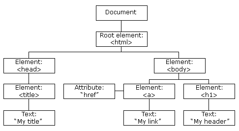

# DOM - Document Object Model

## HTML DOM Tree of Objects

## Ability of DOM

- JavaScript sahifadagi barcha HTML elementlarini o'zgartirishi mumkin

- JavaScript sahifadagi barcha HTML atributlarini o'zgartirishi mumkin

- JavaScript sahifadagi barcha CSS uslublarini o'zgartirishi mumkin

- JavaScript mavjud HTML elementlari va atributlarini olib tashlashi mumkin

- JavaScript yangi HTML elementlari va atributlarini qo'shishi mumkin

- JavaScript sahifadagi barcha mavjud HTML hodisalariga munosabat bildira oladi

- JavaScript sahifada yangi HTML hodisalarini yaratishi mumkin

## DOM 3 PARTS

- Core DOM - standard model for all document types

- XML DOM - standard model for XML documents

- HTML DOM - standard model for HTML documents

 

## HTML DOM Methods

- innerHTML - belgilangan elementni ekranga chiqarib beradi (textcontentdan farqi,bu holatda <h1></h1> va shunga o'xshash teglarni qabul qiladi)

- getElementById - HTMLdagi ID larni select qilganimizda ishlatamiz

## HTML DOM Document

#### Finding HTML Elements

- document.getElementById(id) - Find an element by element id

- document.getElementsByTagName(name) - Find elements by tag name

- document.getElementsByClassName(name) - Find elements by class name

#### Changing HTML Elements

- element.innerHTML = new html content - Change the inner HTML of an element

- element.attribute = new value - Change the attribute value of an HTML element

- element.style.property = new style - Change the style of an HTML element

#### Adding and Deleting Elements

- document.createElement(element) - Create an HTML element

- document.removeChild(element) - Remove an HTML element

- document.appendChild(element) - Add an HTML element

- document.replaceChild(new, old) - Replace an HTML element

- document.write(text) - Write into the HTML output stream

